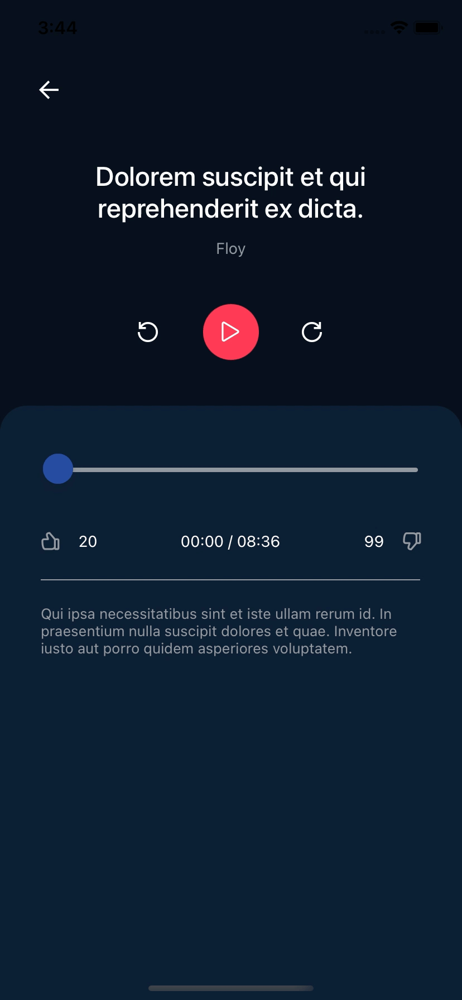

# React Native Audio Player

It is a basic example of an expo-av library which includes many other features.

## Technologies

- React Navigation V6
- Redux Toolkit
- RTK Query
- Formik & Yup
- TypeScript
- React Native Testing Library

## Features

- Authentication flow with React Navigation, Redux Toolkit, Expo Secure Store
- Form validation with Formik and Yup
- Api query management with RTK Query
- State Management by Redux Toolkit
- Displaying SVG files in Production Mode
- Testing screens and components with jest&react native testing library (I just commit login screen test but its going to be continue to other screens)

## Installation

`$ npm install`

#### In case you do not have Expo installed

`$ npm install --global expo-cli`

or [please see](https://docs.expo.dev/)

## Usage

`expo start`

## Thanks

The UI design belongs to [Artur Dziuła](https://dribbble.com/arturdz?ref=uistore.design)
